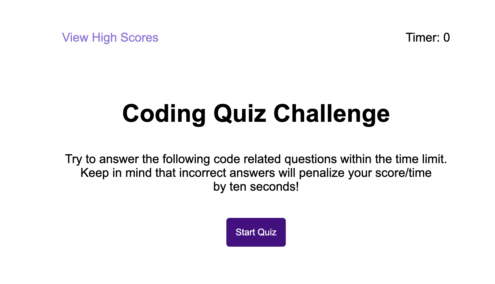
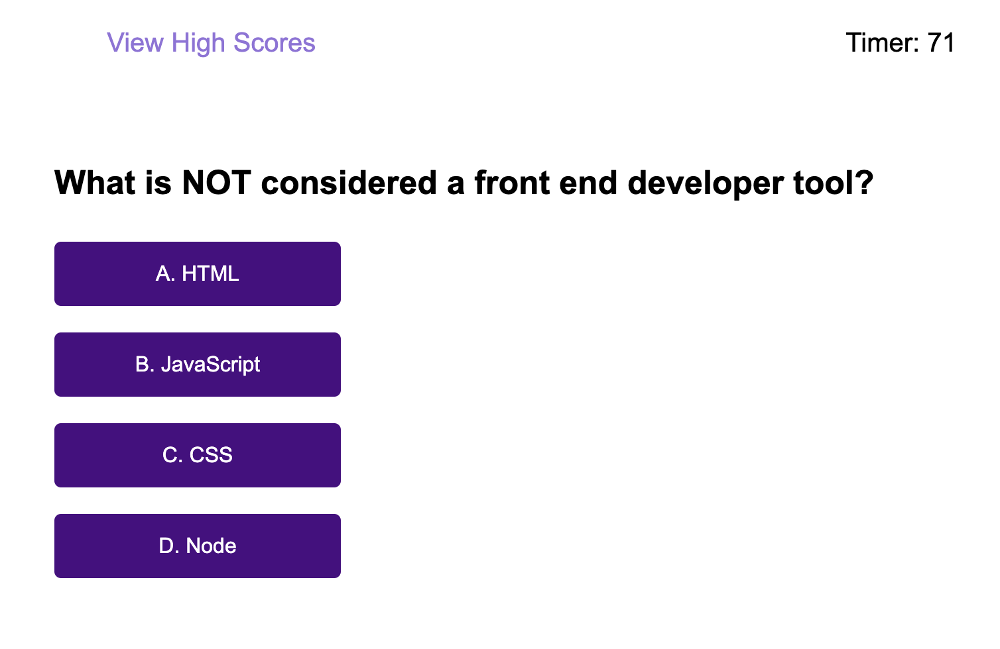
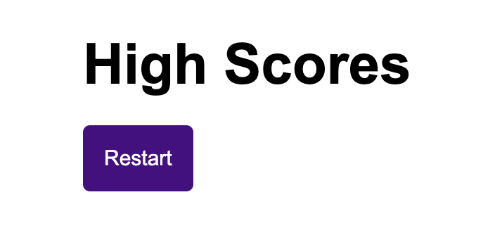

# Time-quiz-game

## Table of Content 
- [Description](#description)
- [Usage](#usage)
- [Visuals](#visuals)
- [Resources](#resources)
- [Author and Acknowledgement](#author-and-acknowledgement)

## Description 

This is a time quiz game where the user have a certain amount of time to finish the quiz with the certain amount of question. 

Once done, the user has the ability to input their initials and see their score. Then the user save the score and it will display all of their previous high score if the user didn't clear the high score board. 

## Usage 

How would a user use this time quiz game

1. Step 1: When the page load, the user is load with a start menu and directions. User will click on "Start Quiz" to start the quiz.

2. Step 2: Answer the following question with the best choices. 

3. Step 3: Enter your initials to save your score and click submit.

4. Step 4: Click restart button if you want to try again and get a better score.

5. Step 5: Click clear score button if you want to erase all your high score that was save previously.

## Visuals

This is what the home page look like when it first loads

This is how the question will look when the start quiz is clicked. The timer will also start 

This is where the initials and score will be displayed

## Resources

- [Live Site](https://vanessaliaw021.github.io/time-quiz-game/)

- [GitHub Repo](https://github.com/VanessaLiaw021/time-quiz-game)

## Authors and Acknowledgement

Coded and Develop by Vanessa Liaw